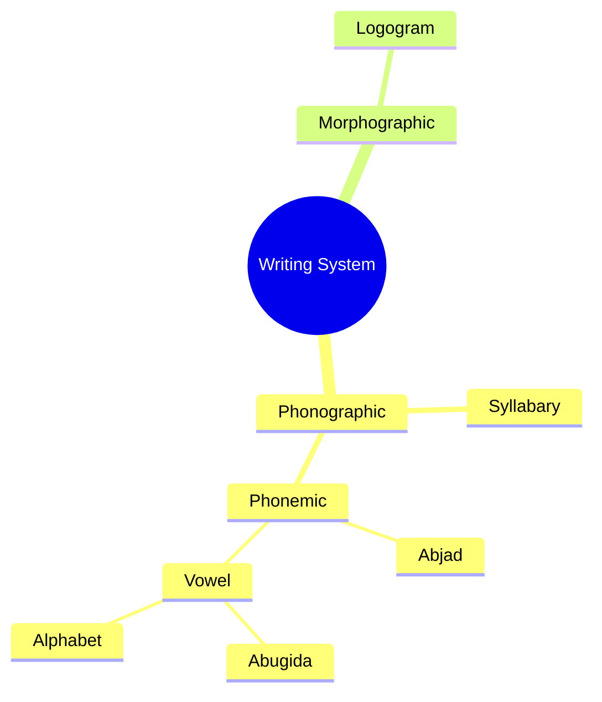

Alt + Shift, switch language

# Gboard
Ctrl + Space, switch 中/a

Shift

- 键盘
    - US-International

[Help with Microsoft Keyboards US-International](https://slcr.wsu.edu/help-pages/microsoft-keyboards-us-international/)

[U.S. International Keyboard](https://www.muhlenberg.edu/academics/llc/onlineresources/windows/usinternationalkeyboard/)

[The complete official IPA chart](https://www.youtube.com/watch?v=OGYGDQgeh2c)

[IPA Chart](https://www.ipachart.com/)

- 时间和语言
    - 输入
        - 键盘高级设置
            - 输入语言热键

ISO 8859-1，正式编号为ISO/IEC 8859-1:1998，又称Latin-1或“西欧语言”，是国际标准化组织内ISO/IEC 8859的第一个8位字符集。它以ASCII为基础，在空置的0xA0-0xFF的范围内，加入96个字母及符号，藉以供使用附加符号的拉丁字母语言使用。曾推出过 ISO 8859-1:1987 版。
